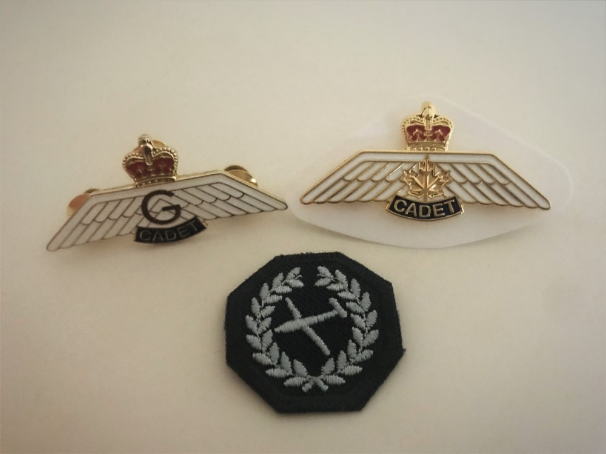
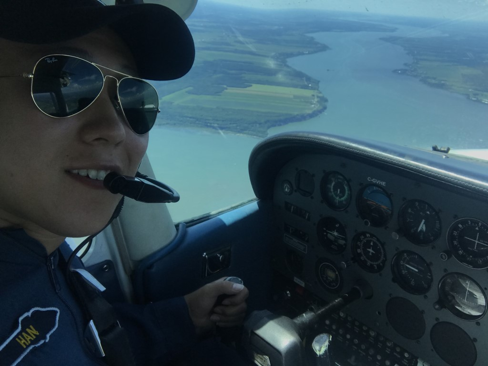
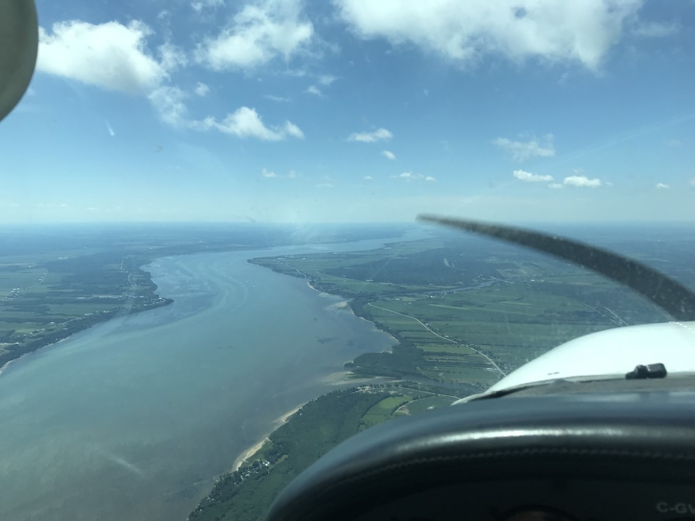

<!-- Content -->
<h3>Glider Pilot Scholarship Course</h3>

In the summer of 2017, I was selected amongst thousands of air cadets across Canada to be part of around 70 people 
for the Air Cadet League's Glider Pilot Scholarship. The selection process took 6 month, starting from ground school to tests, exams,
 and finally, an interview in front of a panel of officers and pilots. The scholarship consisted of 2 month studing at 
 the Mountain View Cadet Flying Training Centre, the same place and scholarship where renowned astronaut Chris Hadfield got his glider's license.

<h3>Power Pilot Scholarship Course</h3>

The Power Pilot Scholarship is similar to the Glider Pilot Scholarship, however it focuses on flying powered aircrafts. Power had a similar selection process with higher standards. Having spent the summer of 2018 to get my Private Pilot's License,
I finished with a 89% on my aviation exam. I received the RÉCOMPENSE ROCKWELL COLLINS AWARD, which came with $2500 and is awarded to 
the cadet who has achieved excellence in the Power Pilot Scholarship Course.

<a href="https://aircadetleague.com/wp-content/uploads/2019/01/2018-Awards-Recipients.pdf">2018 Awards Recipients</a>

	

		

		

		

	

